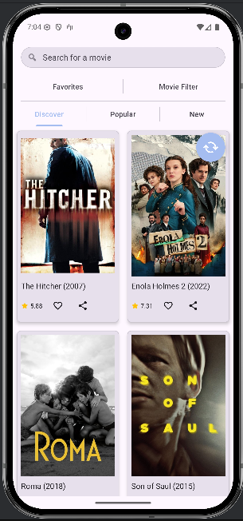
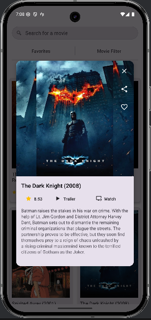
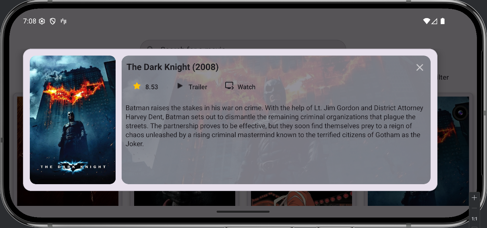

# 📱 Film Atlas


Film Atlas is a movie discovery app for Android focused on recent U.S. theatrical releases.

Film Atlas is a movie discovery app for Android focused on recent U.S. theatrical releases.  
It is designed for exploring what’s new and popular, learning more about each movie, and quickly finding where to watch or learn more.


## Screenshots

<p align="center">
  
  
  
</p>

<p align="center">
  Discover • Movie Details • Landscape Layout
</p>
---

## ✨ Features

- Browse **New**, **Popular**, and **Discover** movie categories  
- Results filtered to **U.S. releases** for better relevance  
- Detailed movie view including:
  - Posters and backdrop images
  - Ratings and release information
  - Trailers
  - External links to TMDB
- Fully responsive layouts for **portrait and landscape**
- **Light and dark theme** support using Material Design 3

### Discover Mode

The Discover tab surfaces randomized movie selections from the TMDB catalog.

The goal is to encourage exploration — similar to opening a dictionary to a random page and discovering whatever words appear there, but applied to movies.

---

## 🛠 Tech Stack

- Java
- Android SDK
- MVVM architecture
- Room database
- Retrofit (TMDB API)
- LiveData & ViewModel
- Material Design 3
- Glide

---

## 📡 Data Source

Powered by **The Movie Database (TMDB)**  
This product uses the TMDB API but is not endorsed or certified by TMDB.

---

## 🚀 Getting Started

### Prerequisites

- Android Studio
- A TMDB API key

---

### TMDB API Key Setup

Film Atlas requires a TMDB API key to run.

1. Create a TMDB account and request an API key.
2. In the project root directory (same level as `app/`), open `local.properties`.
3. Add the following line:

```
TMDB_API_KEY=YOUR_API_KEY_HERE
```

`local.properties` is intentionally excluded from version control and remains local to your machine.

4. Sync Gradle files and run the app in Android Studio.

If the API key is missing, the build will fail with a clear error message.

---

## 🧪 Troubleshooting

If Android Studio shows errors after Gradle or `BuildConfig` changes, run:

```
./gradlew :app:assembleDebug
```

Then re-sync the project.

---

## 📌 Development Notes

Current development tasks and known issues are tracked in:

**[BACKLOG.md](BACKLOG.md)**